# OSINT. Open source intelligence analysis
This is the concept and technology of production and use of military, political, economic and other information from open sources, without violation of laws.
The article provides basic information and tools for analysis.

```mermaid
flowchart LR
    A(OSINT) --> B1(General information)
    A(OSINT) --> B2(Technologies)
     
    B1 --> GL1(<a href='https://www.rand.org/pubs/research_reports/RR1964.html'>Defining Second Generation Open Source Intelligence</a>)
    B1 --> GL2(<a href='https://www.airuniversity.af.edu/Portals/10/ASPJ_Spanish/Journals/Volume-30_Issue-2/2018_2_11_hamilton_s_eng.pdf'>The Big Data Imperative</a>)
    B1 --> GL3(<a href='https://www.frontiersin.org/research-topics/42914/open-source-intelligence-osint-threats-and-opportunities'>Threats and Opportunities</a>)
    B1 --> GL4(<a href='https://www.sciencedirect.com/topics/computer-science/open-source-intelligence'>Open Source Intelligence</a>)
    B1 --> GL5(<a href='https://www.researchgate.net/publication/340301223_Open_Source_Intelligence_OSINT_issues_and_trends'>Issues and trends</a>)

    B2 --> T1(Search engines)
    T1 --> T1L1[<a href='https://google.com'>Google</a>]
    T1 --> T1L2[<a href='https://bing.com'>Bing</a>]
    T1 --> T1L3[<a href='https://www.yahoo.com/'>Yahoo</a>]
    T1 --> T1L4[<a href='https://duckduckgo.com/'>DuckDuckGo</a>]
    T1 --> T1L5[<a href='https://yep.com/'>Yep</a>]

    B2 --> T2(Social networks)
    T2 --> T2L1[<a href='https://desktop.telegram.org'>Telegram</a>]
    T2 --> T2L2[<a href='https://twitter.com'>Twitter</a>]
    T2 --> T2L3[<a href='https://www.facebook.com'>Facebook</a>]
    T2 --> T2L4[<a href='https://www.instagram.'>Instagram</a>]
    T2 --> T2L5[<a href='https://linkedin.com/'>LinkedIn</a>]

    B2 --> T3(Photo and video analysis)
    T3 --> T3L1[link]
    T3 --> T3L2[link]
    T3 --> T3L3[link]
    T3 --> T3L4[link]
    T3 --> T3L5[link]
    
    B2 --> T4(Text analysis)
    T4 --> T4L1[link]
    T4 --> T4L2[link]
    T4 --> T4L3[link]
    T4 --> T4L4[link]
    T4 --> T4L5[link]

    B2 --> T5(Geolocation)
    T5 --> T5L1[link]
    T5 --> T5L2[link]
    T5 --> T5L3[link]
    T5 --> T5L4[link]
    T5 --> T5L5[link]

    B2 --> T6(Transport tracking)
    T6 --> T6L1[link]
    T6 --> T6L2[link]
    T6 --> T6L3[link]
    T6 --> T6L4[link]
    T6 --> T6L5[link]

    B2 --> T7(Phone calls tracking)
    T7 --> T7L1[link]
    T7 --> T7L2[link]
    T7 --> T7L3[link]
    T7 --> T7L4[link]
    T7 --> T7L5[link]
```
